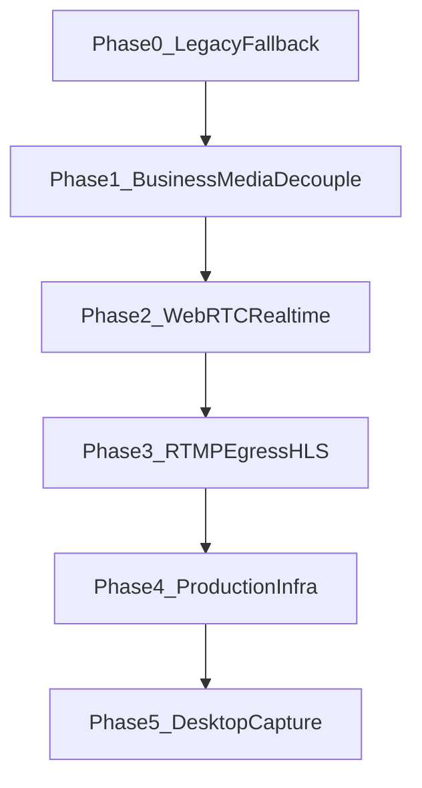

# USKing 直播架构升级：gstack 集成与 Composer 2 执行手册

本文档可直接发给 `composer 2` 执行。

目标不是把 gstack 作为 USKing 的运行时依赖，也不是要求 `composer 2` 原样复制整个 gstack 仓库，而是把 gstack 的开发方法、门禁、角色分工和产物约束，嵌入到 USKing 的直播架构升级与后续开发流程中。

---

## 1. 总原则

### 1.1 你在做什么
你不是在“修一套 JPEG 轮询直播页面”。

你在执行的是 **USKing 从原型直播链路迁移到正式媒体平面架构** 的工程升级，目标是：

- 站内实时观看：`WebRTC`
- 多平台分发：`RTMP`
- 公播/回放：`HLS + CDN`
- 当前 `legacy_jpeg`：只保留为 `fallback / 诊断通道`

权威架构基线：
- [`docs/LIVE_ARCHITECTURE_UPGRADE.md`](./LIVE_ARCHITECTURE_UPGRADE.md)
- [`docs/LIVE_ROLLOUT_PHASES.md`](./LIVE_ROLLOUT_PHASES.md)

### 1.2 gstack 如何嵌入 USKing
gstack 植入 USKing 的方式是：

- 植入 **流程**
- 植入 **门禁**
- 植入 **角色视角**
- 植入 **产物链路**

不是：

- 把 gstack 当业务运行时依赖
- 把 gstack 的代码塞进 FastAPI 主应用
- 让 `composer 2` 跳过规划直接写代码

### 1.3 必须遵守的主流程
每个直播升级阶段都必须完整遵守以下顺序：

`Think -> Plan -> Build -> Review -> Test -> Ship -> Reflect`

这不是建议，是执行纪律。

任何一个阶段都不允许省略 `Plan / Review / Test` 直接推进到下一阶段。

---

## 2. gstack 到 USKing 的映射

| gstack 能力 | 在 USKing 里的作用 |
|---|---|
| `/office-hours` | 澄清当前阶段到底要解决什么，不解决什么 |
| `/plan-ceo-review` | 挑战范围、裁剪任务、避免把“湖”做成“海” |
| `/plan-eng-review` | 锁定单阶段架构、接口、数据流、失败路径、测试矩阵 |
| `/plan-design-review` | 审查主播端/观看端体验，不允许功能做完但体验走样 |
| `/review` | 代码审查，发现完整性漏洞、竞态、回滚缺口 |
| `/codex` | 第二视角审查，可选但推荐用于核心媒体阶段 |
| `/investigate` | 对弱网、音画不同步、播放失败、推流异常做根因调查 |
| `/qa` / `/qa-only` / `/browse` | 用真实页面做直播链路验收，不接受纯静态代码审查代替 |
| `/ship` | 提交、测试、PR、交付检查 |
| `/land-and-deploy` | 合并、部署、生产验证 |
| `/canary` | 上线后观察错误率、播放稳定性、回源问题 |
| `/document-release` | 每个阶段完成后同步更新文档 |
| `/careful` / `/freeze` / `/guard` | 限制编辑范围，避免跨阶段乱改文件 |

结论：

- gstack 在 USKing 中应当作为 **开发治理框架**
- `composer 2` 在执行直播升级时，应当“按 gstack 工作”，而不是“引用 gstack 代码”

---

## 3. Composer 2 角色定义

`composer 2` 在 USKing 直播升级中扮演的是：

- 主实现者
- 阶段责任人
- 文档同步责任人
- 回滚责任人

但不是：

- 架构独裁者
- 一次性重写全部媒体栈的人
- 跳过门禁直接提交的人

`composer 2` 必须把自己当作一个遵守流程的“虚拟工程团队执行器”。

---

## 4. 不可违反的硬约束

### 4.1 不允许一次性重写媒体栈
不允许把以下内容一次性大改并混在一个阶段里：

- `legacy fallback`
- `host-session / viewer-session`
- `WebRTC`
- `RTMP egress`
- `HLS playback`
- `PostgreSQL / Redis / TURN`
- `桌面端采集增强`

这些必须按阶段推进。

### 4.2 不允许未规划先大改
在未完成本阶段 `Plan` 之前，不允许直接大改以下目录：

- `server/`
- `templates/`
- `services/`
- `infra/`
- `docs/`

### 4.3 不允许无根因试错修复
任何复杂直播问题，如果涉及以下关键词，必须先 `Investigate`：

- 音画不同步
- 弱网卡顿
- 房间加入失败
- token 正常但播放失败
- 浏览器兼容性差异
- TURN / ICE / NAT 问题
- RTMP 成功但 HLS 失败

### 4.4 不允许跳过文档同步
每完成一个阶段，必须同步：

- 架构文档
- 部署文档
- 相关服务 README
- 回滚说明

---

## 5. 当前阶段边界总图



阶段权威来源：
- [`docs/LIVE_ROLLOUT_PHASES.md`](./LIVE_ROLLOUT_PHASES.md)

---

## 6. 阶段执行模板

`composer 2` 在进入任何一个阶段之前，都必须先写出以下模板并自审：

```md
## Stage
<Phase 名称>

## Goal
本阶段真正要交付的单一目标。

## Scope
明确做什么、不做什么。

## FilesAllowed
本阶段允许修改的文件与目录。

## ArchitectureDecision
本阶段关键架构决策，包含为什么不选其他方案。

## Risks
主要风险、兼容性问题、回滚点。

## Tests
本阶段必须通过的测试与人工验收清单。

## Rollback
本阶段失败时如何回退，不影响上一阶段稳定性。

## DocsToUpdate
本阶段必须同步更新哪些文档。

## DoneDefinition
什么叫“这个阶段完成”。
```

没有这份模板，不允许进入 Build。

---

## 7. 统一阶段门禁

以下门禁适用于 **每一个 Phase**，不是只在项目开始时执行一次。

## 7.1 Think Gate
### 进入条件
- 当前阶段目标已被明确命名
- 已明确上一阶段产物与当前阶段依赖

### 退出条件
- 能用一句话说明本阶段真正解决的问题
- 已明确本阶段不解决什么

## 7.2 Plan Gate
### 进入条件
- 已完成需求澄清
- 已阅读相关架构文档、阶段文档、现有边界文件

### 退出条件
- 已产出单阶段模板
- 已明确 `FilesAllowed`
- 已明确 `ArchitectureDecision`
- 已明确 `Tests`
- 已明确 `Rollback`
- 已明确 `DoneDefinition`

没有通过 Plan Gate，不允许改核心实现。

## 7.3 Build Gate
### 进入条件
- Plan Gate 已完成
- 编辑范围已被冻结
- 已确认 fallback 不会被破坏

### 退出条件
- 代码实现与阶段目标一致
- 没有引入跨 Phase 的偷偷扩张
- 文档草稿已同步到位

## 7.4 Review Gate
### 进入条件
- 本阶段代码已完整可读
- 自测已完成

### 退出条件
- 关键审查意见已关闭
- 风险点有结论：修复、接受、延后或回滚
- 不存在“以后再补”的关键完整性漏洞

## 7.5 Test Gate
### 进入条件
- Review Gate 已完成
- staging 环境或等价测试环境可用

### 退出条件
- 自动化测试通过
- 人工直播专项 QA 通过
- 关键路径截图、日志或结果可复核

## 7.6 Ship Gate
### 进入条件
- Test Gate 已完成
- 回滚方案已验证
- 文档更新已完成

### 退出条件
- 变更已可交付
- 上线顺序、观察指标、回滚开关明确

## 7.7 Reflect Gate
### 进入条件
- 该阶段已上线或已完成交付

### 退出条件
- 记录本阶段做对了什么
- 记录本阶段踩坑和限制
- 记录下一阶段输入条件

---

## 8. 分阶段执行要求

## Phase 0
### 目标
把旧链路降级为 fallback，不再把它当主架构继续扩展。

### 权威边界
- [`server/live_broadcast.py`](../server/live_broadcast.py)
- [`app/live.html`](../app/live.html)

### 允许的动作
- 补注释
- 补 fallback 标识
- 补回滚说明
- 修必须的兼容问题

### 禁止的动作
- 继续把 `JPEG + polling` 当未来主链路扩功能
- 围绕旧链路做复杂架构投资

### 退出条件
- 所有人都清楚：旧链路只作为 fallback / 诊断链路存在

## Phase 1
### 目标
完成业务层与媒体层解耦。

### 主要边界
- [`server/live_media.py`](../server/live_media.py)
- [`server/api.py`](../server/api.py)
- [`server/config.py`](../server/config.py)
- [`docs/LIVE_ARCHITECTURE_UPGRADE.md`](./LIVE_ARCHITECTURE_UPGRADE.md)

### 必须产出
- 统一媒体配置接口
- host / viewer 会话接口
- 媒体后端选择开关
- fallback 和正式媒体平面的边界说明

### 禁止事项
- 直接把 LiveKit SDK 逻辑硬塞进业务 API
- 让前端自己猜测媒体模式

### 退出条件
- 前后端都能通过统一会话契约识别媒体模式

## Phase 2
### 目标
接入 WebRTC 实时观看主链路。

### 主要边界
- `services/realtime-signaling/`
- `server/live_media.py`
- `templates/watch.html`
- `templates/index.html`

### 重点
- 主播发布真实媒体轨，不再发布 JPEG
- 观看端消费 `viewer-session`
- 音视频同步必须作为第一优先级

### 禁止事项
- 不允许把 WebRTC 与旧 fallback 混成无法切换的状态

### 退出条件
- 单主播、多观众、站内实时观看可用

## Phase 3
### 目标
接通 RTMP fanout 和 HLS。

### 主要边界
- `services/media-egress/`
- HLS manifest 配置
- RTMP 平台分发

### 重点
- 站内实时与平台分发彻底解耦
- 公开页 / 回放页走 HLS

### 退出条件
- 站内 WebRTC、外站 RTMP、公开页 HLS 三条链路职责清晰

## Phase 4
### 目标
完成生产化基础设施升级。

### 主要边界
- `infra/postgres/`
- `infra/redis/`
- `infra/turn/`
- `docs/DEPLOY.md`

### 重点
- PostgreSQL 替换 SQLite
- Redis 负责 presence / 幂等 / 实时元数据
- TURN 成为正式必需件
- 补齐监控与告警

### 退出条件
- 能支撑真实生产环境而不是单机演示

## Phase 5
### 目标
桌面端采集增强。

### 重点
- Windows：Graphics Capture / WASAPI
- macOS：ScreenCaptureKit / AVFoundation
- 解决浏览器对系统音频和后台稳定性的限制

### 退出条件
- 主播端采集能力达到专业直播工具级别

---

## 9. 文件边界与冻结区

## 9.1 业务面优先允许编辑区
- [`server/api.py`](../server/api.py)
- [`server/live_media.py`](../server/live_media.py)
- [`server/config.py`](../server/config.py)
- [`templates/watch.html`](../templates/watch.html)
- [`templates/index.html`](../templates/index.html)
- [`docs/LIVE_ARCHITECTURE_UPGRADE.md`](./LIVE_ARCHITECTURE_UPGRADE.md)
- [`docs/LIVE_ROLLOUT_PHASES.md`](./LIVE_ROLLOUT_PHASES.md)

## 9.2 fallback 冻结区
这些文件默认只能做两类修改：`兼容修复` 或 `回滚保障`。

- [`server/live_broadcast.py`](../server/live_broadcast.py)
- [`app/live.html`](../app/live.html)

禁止把新的主能力继续堆到这里。

## 9.3 媒体平面扩展区
- [`services/realtime-signaling/README.md`](../services/realtime-signaling/README.md)
- [`services/media-egress/README.md`](../services/media-egress/README.md)
- [`infra/turn/README.md`](../infra/turn/README.md)
- [`infra/redis/README.md`](../infra/redis/README.md)
- [`infra/postgres/README.md`](../infra/postgres/README.md)

---

## 10. 直播专项 QA 清单

`composer 2` 在每个关键阶段至少要对照以下 checklist 逐项确认：

- 目标网页画面是否低延迟、稳定、可读
- 摄像头画面是否可开关、可布局、不会遮挡关键内容
- 目标网页声音是否能独立开关
- 麦克风声音是否能独立开关
- 是否支持：
  - 只听网页音
  - 只听麦克风
  - 两路都开
- 是否存在明显音画不同步
- 弱网下是否有明显退化策略
- RTMP 分发是否不拖累站内实时房间
- HLS 公播是否不影响实时观看
- fallback 是否仍可作为回滚开关使用

---

## 11. 发布与回滚纪律

上线顺序必须是：

1. `staging`
2. `review`
3. `qa`
4. `ship`
5. `deploy`
6. `canary`

不允许跳过。

### 回滚优先级
遇到线上问题时，回滚顺序必须是：

1. 先切环境变量回 fallback
2. 先关闭新媒体平面入口
3. 再考虑代码回滚

建议优先使用这些环境变量做回退：

- `LIVE_MEDIA_BACKEND`
- `LIVE_PUBLISH_MODE`
- `LIVE_PLAYBACK_MODE`
- `LIVE_FALLBACK_ENABLED`
- `LIVE_FALLBACK_MODE`

原则：

- 优先回退行为
- 不优先回退代码

---

## 12. 文档同步纪律

每个阶段完成后，必须检查这些文档是否要同步：

- [`README.md`](../README.md)
- [`docs/LIVE_ARCHITECTURE_UPGRADE.md`](./LIVE_ARCHITECTURE_UPGRADE.md)
- [`docs/LIVE_ROLLOUT_PHASES.md`](./LIVE_ROLLOUT_PHASES.md)
- [`docs/DEPLOY.md`](./DEPLOY.md)
- [`services/realtime-signaling/README.md`](../services/realtime-signaling/README.md)
- [`services/media-egress/README.md`](../services/media-egress/README.md)
- [`infra/postgres/README.md`](../infra/postgres/README.md)
- [`infra/redis/README.md`](../infra/redis/README.md)
- [`infra/turn/README.md`](../infra/turn/README.md)
- [`docs/LIVE_GSTACK_WORK_RECORD.md`](./LIVE_GSTACK_WORK_RECORD.md)（阶段复盘、可审计证据索引时更新）

没有文档同步，不算阶段完成。

---

## 13. 禁止事项

`composer 2` 在 USKing 直播升级中，禁止：

- 直接把旧链路继续当主架构扩建
- 跳过规划直接重写媒体层
- 在未明确根因时连续试错式修 bug
- 把多个 Phase 混成一个 PR
- 未经 review / qa 直接上线
- 改了实现不改文档
- 为了赶进度删除 fallback

---

## 14. 最终执行口令

如果你是 `composer 2`，请按以下理解执行：

1. 你必须把 gstack 当作 **开发治理框架**
2. 你必须把 [`docs/LIVE_ARCHITECTURE_UPGRADE.md`](./LIVE_ARCHITECTURE_UPGRADE.md) 当作架构基线
3. 你必须把 [`docs/LIVE_ROLLOUT_PHASES.md`](./LIVE_ROLLOUT_PHASES.md) 当作阶段权威来源
4. 你必须逐阶段推进，不允许跨阶段一次性重写
5. 你必须在每一阶段都完成：
   - Plan
   - Build
   - Review
   - Test
   - Ship
   - Reflect

如果任何一项缺失，该阶段视为未完成。

---

## 15. 工作记录与审计留底

每完成一个里程碑或 Phase，应在 [`docs/LIVE_GSTACK_WORK_RECORD.md`](./LIVE_GSTACK_WORK_RECORD.md) 中补充：阶段范围、仓库证据（PR/提交/关键文件）、测试与 staging 结论、Reflect 要点，便于对照 gstack 全链路复核。
