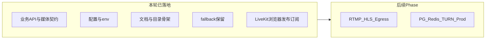

# USKing 直播架构升级与 gstack 嵌入：完整工作记录

本文档面向 **审计、复盘与后续迭代**（含 Composer / 人工协作），说明：

1. **gstack 如何嵌入 USKing**（方法论与仓库产物，而非运行时依赖）
2. **全链路如何对照 gstack**（Think → Plan → Build → Review → Test → Ship → Reflect）
3. **可留底的开发证据**（仓库内文件与接口契约索引）
4. **直播架构在本轮迭代中实际推进到哪一阶段**（与未竟事项）

gstack 上游说明见开源仓库 [garrytan/gstack](https://github.com/garrytan/gstack)（虚拟工程团队工作流、slash 技能链、ETHOS 等）。USKing 不 vendoring 其全部实现，而是 **对齐其流程纪律**。

---

## 1. 摘要结论

| 维度 | 结论 |
|------|------|
| gstack 嵌入方式 | 以 **开发治理框架** 嵌入：门禁、阶段模板、文件边界、QA/回滚/文档同步；**不**作为 FastAPI 或前端 bundle 的运行时依赖 |
| 本轮交付性质 | **业务平面与媒体平面的契约、配置、目录骨架、文档与入口**；**尚未**将 LiveKit/WebRTC、TURN、egress、RTMP/HLS 接到生产级端到端播放 |
| 权威执行手册 | [LIVE_GSTACK_COMPOSER2_EXECUTION.md](LIVE_GSTACK_COMPOSER2_EXECUTION.md) |
| 快速摘要 | [LIVE_GSTACK_COMPOSER2_QUICKSTART.md](LIVE_GSTACK_COMPOSER2_QUICKSTART.md) |
| 架构基线 | [LIVE_ARCHITECTURE_UPGRADE.md](LIVE_ARCHITECTURE_UPGRADE.md) |
| 阶段路线图 | [LIVE_ROLLOUT_PHASES.md](LIVE_ROLLOUT_PHASES.md) |

---

## 2. gstack 嵌入 USKing 的过程（可复制）

### 2.1 原则：嵌入什么、不嵌入什么

- **嵌入**：与 [gstack README](https://github.com/garrytan/gstack) 一致的 **sprint 顺序**（Think → Plan → Build → Review → Test → Ship → Reflect）、角色视角（需求裁剪、工程锁定、评审、真机 QA、发布、文档）、以及 **上游产物驱动下游** 的习惯。
- **不嵌入**：把 gstack 当作 Python 包 import、或把其 `browse`/技能二进制当作 USKing 业务进程的一部分。

### 2.2 在仓库内的落点（“嵌入式”的可执行形式）

USKing 将 gstack **转写为仓库内固定文档 + 代码边界**，使任何执行者（Composer 2 或人类）不依赖外部会话也能遵守同一套纪律：

| gstack 概念 | USKing 仓库落点 |
|-------------|-----------------|
| 阶段目标与门禁 | [LIVE_GSTACK_COMPOSER2_EXECUTION.md](LIVE_GSTACK_COMPOSER2_EXECUTION.md) 第 7 节「统一阶段门禁」、第 8 节「分阶段执行要求」 |
| 单阶段必填模板 | 同文档第 6 节（Goal / Scope / FilesAllowed / …） |
| 文件冻结与允许编辑区 | 同文档第 9 节 |
| 直播专项 QA | 同文档第 10 节 |
| 发布与回滚 | 同文档第 11–12 节 |
| 业务 vs 媒体解耦 | [server/live_media.py](../server/live_media.py)、[server/api.py](../server/api.py) 中媒体会话 API |
| fallback 明确降级 | [server/live_broadcast.py](../server/live_broadcast.py) 注释与职责边界 |

可选增强（团队内部）：在开发者个人的 Claude/Codex 环境中安装 gstack 技能，用于 **对话内** 触发 `/plan-eng-review`、`/qa` 等；这与 USKing **仓库行为** 独立，但可与本手册互补。

---

## 3. 全链路对照 gstack：可审计工作证据

以下按 gstack 主线说明 **本轮迭代中** 在仓库内留下的对应证据。若需更严审计，可在后续每个 Phase 增加：`docs/audit/YYYY-MM-DD-phaseN.md`（会议纪要、staging URL、截图哈希、PR 号）。

### 3.1 Think（澄清问题与边界）

- **证据**：架构目标与双平面定义 — [LIVE_ARCHITECTURE_UPGRADE.md](LIVE_ARCHITECTURE_UPGRADE.md)
- **证据**：分阶段路线图 — [LIVE_ROLLOUT_PHASES.md](LIVE_ROLLOUT_PHASES.md)
- **证据**：产品侧原始需求索引 — [REQUIREMENTS.md](REQUIREMENTS.md)

### 3.2 Plan（锁定阶段范围与契约）

- **证据**：Composer 执行手册（含禁止跨 Phase 重写、模板、门禁）— [LIVE_GSTACK_COMPOSER2_EXECUTION.md](LIVE_GSTACK_COMPOSER2_EXECUTION.md)
- **证据**：环境变量契约 — [server/config.py](../server/config.py)、[.env.example](../.env.example)

### 3.3 Build（实现与骨架）

| 内容 | 仓库证据 |
|------|-----------|
| 媒体平面抽象与房间/会话 | [server/live_media.py](../server/live_media.py) |
| 媒体 API | `GET /api/live/media/config`、`POST /api/live/media/host-session`、`GET /api/live/media/viewer-session/{username}` — [server/api.py](../server/api.py) |
| 直播用户接口含 `media` 描述 | 同 [server/api.py](../server/api.py) 中 `get_user_stream` 等相关路由 |
| 观看页识别媒体元数据 / WebRTC 播放 | [templates/watch.html](../templates/watch.html) |
| LiveKit 浏览器封装 | [static/js/livekit-usking.js](../static/js/livekit-usking.js) |
| 主播 SPA / 独立采集页发布 | [templates/index.html](../templates/index.html)、[app/live.html](../app/live.html) |
| fallback 链路（非主架构） | [server/live_broadcast.py](../server/live_broadcast.py) |
| 子服务与基础设施说明（占位） | [services/realtime-signaling/README.md](../services/realtime-signaling/README.md)、[services/media-egress/README.md](../services/media-egress/README.md)、[infra/postgres/README.md](../infra/postgres/README.md)、[infra/redis/README.md](../infra/redis/README.md)、[infra/turn/README.md](../infra/turn/README.md) |
| 顶层入口 | [README.md](../README.md)「直播架构」章节 |

### 3.4 Review（静态一致性与完整性）

- **证据**：执行手册中的 Review Gate 定义 — [LIVE_GSTACK_COMPOSER2_EXECUTION.md](LIVE_GSTACK_COMPOSER2_EXECUTION.md) §7.4
- **说明**：建议在后续 Phase 为每次 PR 保留 **PR 描述 + 变更文件列表 + 风险说明**（可引用本节表格）。

### 3.5 Test（验证）

- **已声明的校验**（本轮摘要）：Python `py_compile`、相关文件 lint；具体命令与 CI 配置以仓库 [README.md](../README.md)、CI 脚本为准。
- **直播专项**：执行手册 [LIVE_GSTACK_COMPOSER2_EXECUTION.md](LIVE_GSTACK_COMPOSER2_EXECUTION.md) §10；配置 LiveKit 后应做 **弱网 / 多浏览器 / 无 TURN 场景** 回归（生产 TURN 见 [DEPLOY.md](DEPLOY.md)）。

### 3.6 Ship（交付形态）

- **交付物**：文档 + 配置契约 + API + 前端（含 LiveKit 客户端回环）+ 目录/README 骨架；**生产集群**（egress、多节点 SFU、全球 TURN）仍按 Phase 3–4 推进。
- **入口链接**：根 [README.md](../README.md) 已链向执行手册与架构文档。

### 3.7 Reflect（复盘与下一跳）

- **本轮结论**：已完成 **Phase 0–1 契约与骨架**；**Phase 2（LiveKit 浏览器侧）**：在配置 `LIVEKIT_*` 且 `LIVE_*_MODE=webrtc` 时，主播/观众通过 `static/js/livekit-usking.js` 建连并发布/订阅轨；失败或未配置时回退 legacy。旧链路仍明确为 fallback。
- **Phase 2 补强**：补上观看页浏览器音频解锁/诊断 UI，避免“远端已订阅但用户无声”；同时把直播列表缩略图与正式观看链路解耦，在 LiveKit 主链路下继续保留低频 JPEG 预览推送。
- **下一跳**（按 [LIVE_ROLLOUT_PHASES.md](LIVE_ROLLOUT_PHASES.md)）：生产级 TURN/ICE、egress（RTMP/HLS）、多轨精细策略、PostgreSQL/Redis 与监控。

---

## 4. 直播架构迭代全过程（本轮范围说明）

- **已完成**：双平面叙事、媒体会话 API、`media` 描述贯通业务接口、环境变量开关、fallback 定位、执行手册与阶段门禁文档化；**LiveKit 前端闭环**（需自备 LiveKit Server）。
- **未完成（预期在后续 Phase）**：egress 转 RTMP/HLS、大规模公播与回放、生产 TURN 与容量、PostgreSQL/Redis 替换单机状态等。

---

## 5. 后续 Composer 使用本记录的方式

1. 新开 Phase 时，先复制 [LIVE_GSTACK_COMPOSER2_EXECUTION.md](LIVE_GSTACK_COMPOSER2_EXECUTION.md) 第 6 节模板，填好再写代码。
2. 每 Phase 结束在本文件 **§3** 增补一行表格或追加「Phase N 证据」小节（PR、commit、staging、截图）。
3. 若引入外部 gstack 技能会话，在 Reflect 中记录 **使用了哪些 slash 等价活动**（如计划评审、真机 QA），与仓库证据交叉引用。

---

## 6. 文档修订记录

| 日期 | 说明 |
|------|------|
| 2026-03-26 | 初版：gstack 嵌入说明、全链路证据索引、本轮架构迭代范围与下一跳 |
| 2026-03-26 | Phase 2：LiveKit 客户端、`watch.html`/`index.html`/`live.html` 接入、`live_media.py` 匿名 identity 修复、文档与 `.env.example` 更新 |
| 2026-03-26 | Phase 2 补强：WebRTC 观看页音频解锁与分轨提示、LiveKit 下低频列表预览恢复、部署文档明确主链路与 fallback 边界 |
| 2026-03-28 | Phase A：`server/live_media_providers.py`（`MediaProvider` / `ManagedLiveKitProvider` / `LegacyFallbackProvider`），`live_media` host/viewer 会话统一挂载 `providers` 元数据；Phase B：`static/js/live-host-publish.js`（`USKingLiveHost.connectHostRealtime`），`templates/base.html` + `app/live.html` 引入，`index.html`/`live.html` 主播建连走 SDK；测试 `tests/test_live_media_providers.py`；架构说明见 `LIVE_ARCHITECTURE_UPGRADE.md` |
| 2026-03-28 | Phase C：`live_observability` 新增 recording job 状态写实化、egress 状态快照与序列化；`api.py` 新增 `POST /api/live/egress/event`、`GET /api/live/egress/status/{username}`、`GET /api/live/recordings/{username}`；`viewer-session` 在 HLS 未 ready 时回退 interactive/fallback；`watch.html` + `hls-usking.js` 增加 HLS 首帧、fatal error、重试与回退处理；补充 `tests/test_live_egress.py` 与部署/架构文档更新 |
