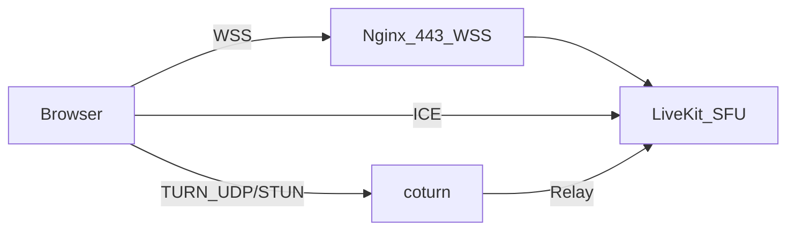

# 独立 coturn（生产推荐）

LiveKit 仅负责 SFU 与信令；**NAT/防火墙下的连通**依赖 **TURN**。自托管 LiveKit 内置 TURN 易与站点 443、证书、端口模型冲突，推荐 **独立 coturn**，由 USKing 后端按 [TURN REST](https://datatracker.ietf.org/doc/html/draft-uberti-behave-turn-rest-00) 风格签发临时 `username` / `credential`，通过 API 下发标准 `ice_servers`。

## 架构



## 生产验证结论

- 当前实战验证已跑通的最小稳定组合是：`TURN_UDP_URL=turn:...:3478?transport=udp` + `TURN_STUN_URLS=stun:stun.l.google.com:19302`。
- 在阿里云/云主机 NAT 场景下，coturn **不要直接绑定公网 IP**；应使用内网 IP 做 `listening-ip` / `relay-ip`，并用 `external-ip=公网/内网` 对外宣告。
- 若尚未准备好独立证书与 443/TLS TURN，不必强上 `TURN_TLS_URL`；先把 UDP TURN 跑稳。

## DNS 与证书

- 为 TURN 单独申请子域名，例如 `turn.usking.vip`，A 记录指向与 LiveKit 同机或独立机器公网 IP。
- 只有当你要启用 `TURNS(5349/443)` 时，才需要 Let’s Encrypt：`certbot certonly --nginx -d turn.usking.vip`（或 DNS 验证）。

## coturn 配置要点

1. 复制 [`turnserver.conf.example`](./turnserver.conf.example) 为 `/etc/turnserver.conf`（路径以发行版为准）。
2. 云主机 NAT 场景下设置：
   - `listening-ip` = 机器内网 IP
   - `relay-ip` = 机器内网 IP
   - `external-ip` = `公网IP/内网IP`
3. 配置 `use-auth-secret` + `static-auth-secret`，与 USKing 环境变量 **`TURN_SHARED_SECRET` 完全一致**。
4. `realm` / `server-name` 建议与 TURN 域名一致。
5. 开放端口（云安全组 + 本机防火墙）：
   - TCP+UDP **3478**
   - TCP+UDP **50000-54999**（coturn 中继段）
   - TCP **7881**（LiveKit TCP ICE）
   - UDP **55000-60000**（LiveKit RTP/ICE）
   - 若启用 TURNS，再额外开放 TCP **5349** 或 **443**

## USKing 环境变量

在 `.env` 中设置（参见仓库根目录 `.env.example`）：

| 变量 | 说明 |
|------|------|
| `TURN_ENABLED=true` | 启用后端签发 `ice_servers` |
| `TURN_REALM` | 与 coturn `realm` 一致 |
| `TURN_SHARED_SECRET` | 与 coturn `static-auth-secret` 一致 |
| `TURN_UDP_URL` | 如 `turn:turn.usking.vip:3478?transport=udp` |
| `TURN_TLS_URL` | 可留空；若启用 TURNS，再填如 `turns:turn.usking.vip:5349?transport=tcp` |
| `TURN_CREDENTIAL_TTL_SECONDS` | 凭证有效期（秒），默认 86400 |
| `TURN_STUN_URLS` | 可选额外 STUN，逗号分隔 |

## LiveKit 侧

建议在 `livekit.yaml` 中**关闭内置 `turn:`**，并将 LiveKit 媒体端口放到 **`55000-60000`**，避免与 coturn 的 `50000-54999` 冲突。参见 [`../livekit/livekit.yaml.example`](../livekit/livekit.yaml.example)。

## 安装（Debian/Ubuntu 示例）

```bash
sudo apt-get update && sudo apt-get install -y coturn
sudo cp infra/turn/turnserver.conf.example /etc/turnserver.conf
sudo nano /etc/turnserver.conf
sudo sed -i 's/^#TURNSERVER_ENABLED=.*/TURNSERVER_ENABLED=1/' /etc/default/coturn
sudo systemctl enable coturn
sudo systemctl restart coturn
sudo journalctl -u coturn -n 50 --no-pager
```

## 验证

```bash
bash scripts/smoke-turn-connectivity.sh turn.usking.vip
```

浏览器主播端 Console 搜索 `[LK:rtc] local candidate`，应出现 `typ relay` 或 `typ srflx`。
若 coturn 日志出现 `ALLOCATE processed, success`，说明 TURN 凭证与中继链路已生效。

## 回滚

1. 设置 `TURN_ENABLED=false` 并重启 USKing Web。
2. 前端将不覆盖 `rtcConfig`，回退为 LiveKit 客户端默认 ICE（仍建议尽快恢复可用 TURN）。

## 第二阶段：独立公网 IP + TURNS 443

若企业网仅放行 443：为 coturn 单独申请 **第二公网 IP** 或独立小机，将 `tls-listening-port=443`，`TURN_TLS_URL=turns:turn.usking.vip:443?transport=tcp`，与站点 Nginx 443 分离。这个阶段应在当前 UDP TURN 稳定后再做，不建议与首轮修复同时推进。
